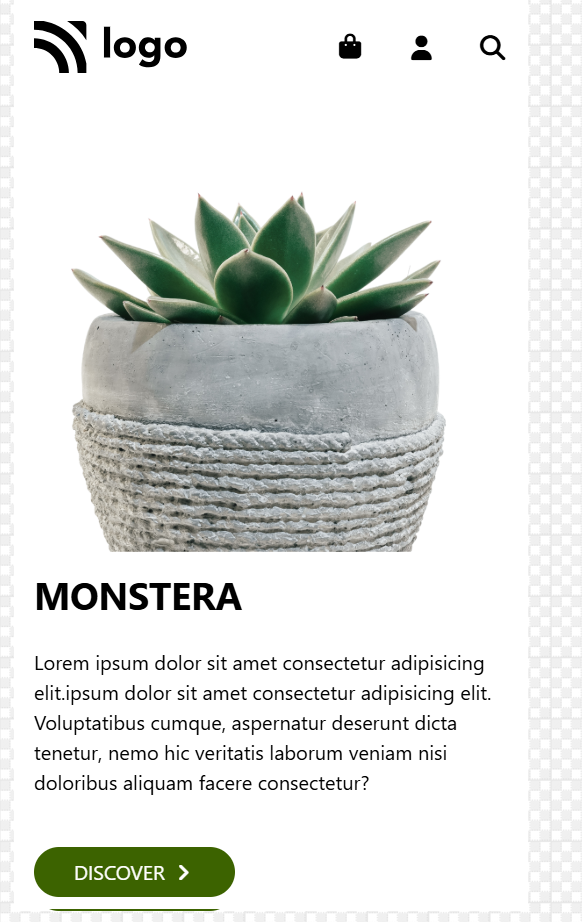

# CSS Project 03
## [Live @](https://css-proj03.netlify.app/)

## 1.Laptop

## 2.Mobile

## 3.Tablet


## 📋Overview
<p>This project is a modern product landing page designed for a Monstera plant shop. It’s built using HTML, Tailwind CSS, and Font Awesome, and demonstrates a clean, minimal UI with responsive design.</p>
<p>The page showcases a hero section, navigation menu, product image, and feature highlights such as care, light, and feeding instructions.<p>

## 🛠️Technologies Used
<ul> 
<li>HTML5 — Page structure and semantic content</li>
<li>Tailwind CSS (via CDN) — Utility-first CSS for styling and responsiveness</li>
<li>Font Awesome (via CDN) — Vector icons for UI elements</li>
<li>Responsive Design — Adjusts layout for mobile, tablet, and desktop screens</li>
</ul>

## 🧩Key Features
#### <ul>
**🧭Navigation Bar**
<li>Logo on the left</li>
<li>Navigation menu with links</li>
<li>Icons on the right using Font Awesome</li>
<li>Fully responsive — navigation collapses on smaller screens.</li>

**🏠Hero Section**
<p>The main section introduces the product and brand identity.
It consists of :</p>

**<li> Left side:</li>**
<P>Large product name , Descriptive text paragraphs , call-to-action button with an arrow icon , Decorative dotted vertical line for design aesthetics</p>

**<li>Right side:</li>**
<p>Displays a hero image: For large screens and For mobile view
</P>

**🌱 Feature Section (Bottom)**
<li>Three cards highlight essential product care features</li>  
<li>Each feature uses flexbox for alignment and consistent spacing.</li>

## 📂Structure
```
monstera-landing-page/
├── index.html              # Main HTML file
├── Logo.svg                # Website logo image
├── 03_flower.png           # Mobile hero image
├── 03_flowerCut.png        # Desktop hero image
└── README.md               # Project documentation
```
